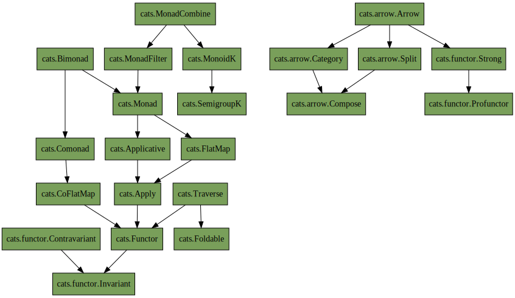

# Scala cats demo project

## Useful links:

- cats book:
  - [HTML](https://www.scalawithcats.com/dist/scala-with-cats.html)
  - [PDF](https://www.scalawithcats.com/dist/scala-with-cats.pdf)
  - [ePUB](https://www.scalawithcats.com/dist/scala-with-cats.epub)
  - [Source code](https://github.com/scalawithcats/scala-with-cats)  
- [cats typeclasses hierarchy](https://blog.rockthejvm.com/cats-typeclass-hierarchy/)
- [All cats typeclasses](https://typelevel.org/cats/typeclasses.html)
- Awesome scala lessons [on YouTube](https://www.youtube.com/rockthejvm)
- [cats 101 on YouTube](https://www.youtube.com/results?search_query=Rock+the+JVM+cats)
- To become a PRO: [herding cats](https://eed3si9n.com/herding-cats/index.html)
- [Library](https://github.com/typelevel/simulacrum) to generate type call boilerplate (ops, syntax, implicits, etc.)

## cats typeclasses hierarchy
